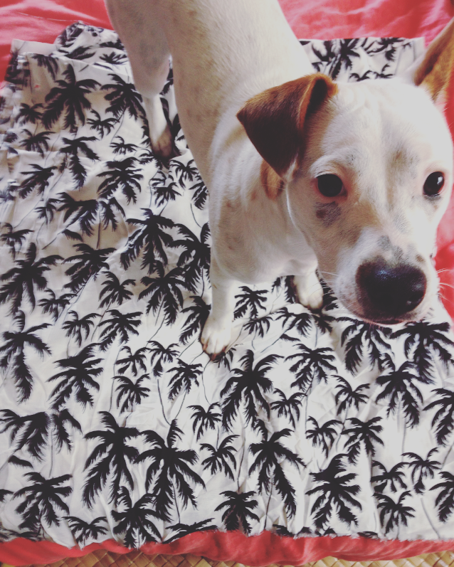

```{r setup chunk, setup, include = FALSE, cache=FALSE, message=FALSE, warning=FALSE}
# for this lesson you will need to download the following packages
# if you don't have them already in your library, the following code can be used
# this will install the package if it does not already exist on your machine


# load packages
if (!require("pacman")) install.packages("pacman") # for rapid install if not in library
pacman::p_load('knitr', 'lme4', 'lmerTest', 'effects', 'dplyr', 'plotrix')

# in this area (above you can put global options, such as "no warmings", "no messages")
# you can also set global directory like this....knitr::opts_knit$set(root.dir = '~/file/file') 
# instead, use R projects and all your files will be in the location of your Project... see here

# or you can set it like this...
#knitr::opts_chunk$set(warning=FALSE, message=FALSE)

#getwd() # show me my working directory, this is where your R project and files are
```

## This is an R Markdown!

R markdown is great, and when I say great, **I mean REALLY great.**   
  
When exporting your markdown you can...  
  *(1) embed figures*  
  *(2) view tables*  
  *(3) export models*  
  *(4) archive your data pipeline*  
  
You can write code and execute functions in a similar way to normal R script files. However, there are a few distinct differences between R scripts and R markdown scripts. Some of these differences relate to how code is executed. Other differences can be seen in the added benefit of integrating scripts with outputs and other embedded properties.  

The benefit of using markdown with colleagues is they can actually see the script, the figures, the path of model selection, even the assumptions of ANOVA (QQ plots, etc) that normally are hidden behind the curtain. In short, **R markdown helps make your science repeatable, sharable, and data analysis coherent!**  
  
Here are some common commands and examples of what Markdown can do for you. I reccommend visiting the [R Bookdown for a complete and exhaustive guide](https://bookdown.org/yihui/rmarkdown/ or the [R markdown cheat sheet](https://www.rstudio.com/wp-content/uploads/2015/02/rmarkdown-cheatsheet.pdf)
    
If you want to test yourself, the [R Markdown tutorial](https://www.markdowntutorial.com/) is another great guide.
  
## Markdown basics
  
  
### First: Git with R Projects  
My first advise to you would be to set up a [GitHub account](https://github.com/). Having a GitHub allows you to have all your code, markdown, figures, data, etc archived online for safety and version control. You can make these repositories private or collaborative. It is easy! There are a lot of resources out there on why/how to use GitHub, and you'll see why it is important as you advance your carpentry--you can [read about how painless this is](http://happygitwithr.com/big-picture.html).
  
Whether you choose to GIT with it, or stick with running from your device, you should start by making an *R project* in R-Studio. You can read all about how to do this at [happygitwithR.com](http://happygitwithr.com/rstudio-git-github.html). 
  
In R Studio, clicking the option to make an R project with version control will set you on the path to linking with GitHub (if you go this route, see [happygitwithR.com](http://happygitwithr.com/rstudio-git-github.html) first, as you must set up a github account, then make a repository, then use the repository URL to link to your R project). 
  
If you decide to instead without version control, then set up the project wherever you wish on your computer. When you set your "R Project" directory, R Studio will generate a folder that houses your R Project. From here you can create your Rmd file and folder directory as you wish. For best practices, I recomment setting up a directory for each project (*see directory for this project below*). From here, everytime you open want to work on this project in R studio, click on the Project. This will allow you to load data in a simple way that anyone can understand (i.e., upload file "symbiont.csv", from folder "data")--and it is easy to share this structure with collaborators.  
  
Yet another reason to use R Projects: it will eliminate the pesky and sometimes overly personal directories we all have on our desktop aka: "~/Desktop/PhD/WTFproject/NeverGoingToGetPublished/data.csv"
  
<center>  
  
{ width=30%}
  
</center>  
  
  
### Common Commands 

*Notice the script at the very top of your markdown (this is not standard, but is customized)*  

***  
output:  
  html_document:  
  code_folding: hide  
  toc: yes  
  toc_depth: 3  
  toc_float: yes 
***  
  
Let's go through this line by line...  
  
- `html_document`: an option you originally set when you open the markdown. This is how your file will be exported.  
- `code_folding: hide` will allow you to *show* or *hide* all code (option at top of file)  
- `toc`:  for table of contents on the left  
- `toc_depth`:  how many header levels you will have in table of contents  
- `toc_float`: lets your contents move as you advance in your document.  
  
*Play around with these options, and see how they affect your code*  

There are other options too, such as `number_sections: true` to add numbering to your sections.  
  
### The setup chunk
- First, if you want to make a new chunk (where code is written), use the shortcut! `Control + Option + I"` will generate a new chunk for you 
  
- ` r setup `:  This is your set up code and is a useful way to get around the fact that knitr will look for your .Rmd file and all files in the this directory. By setting the root.dir you can force knitr to look for files in the directory you specify and the folders within.  

In the setup chunk (the first code chunk) you can set 'global' options, such as message/warning exclusion, or hiding results or outputs.  
`knitr::opts_chunk$set(warning=FALSE, message=FALSE)`: This command here is requiring the package `knitr` in the code chunk ('set' for set up) and is saying to "make all warning and message FALSE" i.e., hide them from output.  
  
- `include=FALSE`:  this command makes your code absent from final html. It is executed but the code is hidden.  

- `eval=FALSE`:  this command allows you to show the code in your script within R studio, but not evaluate (or run) the code. It is effectively silent in your analysis and output html.

- `echo=FALSE`:  this will show the output but not the code chunk...  notice the difference.

- `results='hide'`: this will hide all results in a code chunk, or any returned results from your commands.  

- `collapse = TRUE`: this is one of my new favorites. You enter this to your chunk options for a code chunk to run all the way through and not separate into pieces of results. This is usueful if you have lots of outputs (even if they are hidden using `results='hide'`, the code chunk will still give breaks where results would be. Collapse = TRUE stops this.)
  
   
### Text formatting  
It is useful to understand how to modify text and format headings. You can do this in a variety of ways.    

- `line break`: this is executed by two spaces at the end of previous line, and a return     
  
- `headings`: use `#` for headings, `#`.... `####` and so on.  # is largest and #### smallest heading

`Italics` comes from two calls *italics* or _italics_; `bold` is done the same way **bold** and __bold__  
  
- `Superscript` superscript^2^ or `strikethroughs`  ~~strikethrough~~ can also be useful text modifiers.  
  
- `add links` to urls like this [R studio link](www.rstudio.com)  
  
- `endash` : --   
- `emdash`: ---  
- `ellipsis`: ...   
  
- `inline equation`: $A = \pi*r^{2}$ or $y = a*x+ b$  
  
- (a line can inserted with `***`) 
  
- using the `>` before and after a line can give you a quote/emphasis, such as...  
  
> "Its Van Halen, not Van Hagar!"   
> - Garth Algar


***   

  
### Code chunks
  
Code chunks are where your code is executed. If you do not set the working directory in *setup* each code chunk will revert to its original directory, or where your .Rmd file lives. This is one more reason why you should run everything out of your R Project.  
```{r}
## love your data and it will love you back
getwd() #where are your files? See how they should all be running from your R project in the directory
``` 
  
Below: This is a code chunk, and this is how you enter your data into R markdown. Note the `code chunks` always start with a ` ```{r...}` and ends with a `{...}`. You can add these chunks with the shortcut `Control + Option + I"`.  
  
The code chunk below is an example of attaching the data (.csv), familiar to you R-heads. Since the data file is in the directory specified by ` knitr::opts_knit$set(root.dir =... ` above, you can reference the .csv easily.


```{r}
################################################
# import data, observe structure
################################################

# data file is in the folder 'data', within main working directory
data<-read.csv("data/coral_data.csv")
names(data)
```
  
   
### Including figures
You can include figures from script output as results, or figures from files in your directory. First, let's see how you can add an image from a file to your markdown.

<center>  

{ width=50% }

</center>  

Adding figures this way can help you present your results for GIS maps that may have been rendered outside of R, or imagery that you want to include of your study organisms, etc.
  
<center>  
  
{ width=30%}  
  
</center>  
  
Note in the coding above I used the html codes for centering the image and the caption. You must leave a line between the first html call `<center>`, the caption and image code, and the end html code line of `</center>`.


### Figure formatting
- `fig.show=FALSE`: this will hide the figures you generate. This may be useful for some of those assumptions of ANOVA-- you want to see it, but do you want all of them in your final archived datafile? Maybe not.  

- `fig.width=5, fig.height=3`: The (graphical device) size of R plots in inches. This records your output figure as a graphical device using *knitr* and will write this to files. There are other ways to edit figure size from this intial dimension (*see below*). You can also specify the two (width and height using) `fig.dim`, as in the previous examle `fig.dim = c(5, 3)`  
  
- `out.width` and `out.height`: These set the output of a figure in output document. This is best to scale the image realtive to document dimensions, such as `out.width= "50%"` would be 50% of page width.

- `fig.align`: gives you figure alignment as either: right, center, left.  
  
- `dev`: graphical devices, typically `png` (html) or `pdf` for LaTex.  
  
- `fig.cap`: caption your figure  
  
- `fig.show`: options here control your figures. Setting to `'asis'` will show plots in the location they were generated (similar to R terminal--this is the default). If you set to `'hide'` then the figures are generated but not shown in your output file. Another option below is my favorite.
  
- `fig.show='hold'`: this is a really cool option. This option holds you plots and doesn't display until the end of the code chunk. You can use it to place multiple figures side-by-side as long as the `out.width` is called. For example, two plots side-by-side at `out.widh="50%"`  
  
Now let's use some of these options to see how this code could be executed.
```{r first plot example, fig.show='hold', out.width= "20%", fig.align='center', fig.cap="**Figure 4. Example of side-by-side plots at 50%, with a 'fig hold' option**"}
data<-read.csv("data/coral_data.csv")
par(mar = c(4, 6, 0.2, 0.1))
plot(data$biomass, pch=16, cex=1.2, col="mediumseagreen",
     ylab=expression(paste("Biomass", ~(mg~cm^-2), sep="")))
plot(data$chla, pch=16, cex=1.2, col="coral",
      ylab=expression(paste("Chlorophyll", ~italic("a"+"c"[2]), ~(mu*g~cm^-2), sep="")))
plot(data$biomass, pch=16, cex=1.2, col="mediumseagreen",
     ylab=expression(paste("Biomass", ~(mg~cm^-2), sep="")))
plot(data$chla, pch=16, cex=1.2, col="coral",
      ylab=expression(paste("Chlorophyll", ~italic("a"+"c"[2]), ~(mu*g~cm^-2), sep="")))
```
  
  
But something to consider... R scripts in code chunks operate a bit differently than classic R scripts. If you want to run your plot commands line-by-line you may need to include calls, such as `with()` or `par(new=T)` to specify that you do NOT want a new plot device to be made, but instead to keep working on the device you have opened. So to execute the whole chunk hit the green arrow in the right of the chunk, or highlight *all* the lines you want to run and execute them this way.
```{r, results="hide", fig.dim=c(5,3), fig.align='center', fig.cap=""}
# use results="hide" here to suppress messages associate with "dev.off" and dev.print to save figure

MC.df<-data[(data$Species=="MC"),] ## Montipora capitata alone
PC.df<-data[(data$Species=="PC"),] ## Porites compress alone

par(mar = c(4, 4, 3, 0.1))

plot(density(MC.df$biomass), lwd=2, col="darksalmon", xlim=c(0,100), main="Figure example. Tissue biomass in two coral species", cex.main=0.8, xlab=expression(paste("Biomass", ~(mg~cm^-2), sep="")))
lines(density(PC.df$biomass), lwd=2, col="darkslategray3", yaxt="n", ylab="", xaxt="n", xlab="")
legend("topright", legend=c(expression(italic("Montipora capitata")), expression(italic("Porites compressa"))), lwd=2, col=c("darksalmon", "darkslategray3"), bty="n")


# how to export the figure you made--first print it, then save the device
# many ways to do this, but this one works well in Markdown
# notice you are specifying the folder ('figures'), which is where the figure will be exported to

dev.print(pdf, "figures/biomass in two species.pdf", encod="MacRoman", height=4, width=6) # export in directory
dev.off()

```

 
### Now let's play!
In this chunk we will make use of some data of photopigments (Chlorophyll *a* concentrations cm^-2^) in bleached and pigmented corals. Some of the syntax here should be familiar...

```{r chlorophyll a figure, results='hide', fig.align='center', fig.cap="**Figure 5. Chlorophyll a density**. *Note: This caption was set in code chunk setting*", fig.dim=c(4,4)}
# message = FALSE to hide any messages with exporting the figure with dev.off(), or anything else that R may generate. If you set warning=FALSE, warnings will be hidden as well. 

par(mfrow=c(1,1), pty="sq")
Status.label<-c("Bleached", "Pigmented") # for x labels

plot(chla~Status, data=data, xaxt="n", col="salmon",
     ylab=expression(paste("Chlorophyll", ~italic("a"), ~(mu*g~cm^-2), sep="")), 
     xlab="Coral Physiological State", 
     main="Example Figure")
axis(1, at=1:2, labels=Status.label) # this plots new labels on the x axis (axis = 1)

##### save the figure and export to directory? ####
# in this case, there is a file in my directory names 'figures' where I want plots to go

dev.print(pdf, "figures/Chlorophyll.figure.pdf", encod="MacRoman", height=5, width=5) 
# height and width set here for the output figure
dev.off() # close the object
```
  
I'm using ```dev.copy(pdf, "figures/Chlorophyll.figure.pdf", encod="MacRoman", height=5, width=5)``` to print the devise, export it as a pdf, save in the folder names "figures", I'm naming the figure as "Chlorophyll.figure.pdf", and exporting at 5x5 dimensions. Note the code chunk option is specifying to print the figure in the Markdown at a smaller scale (4x4).
  
  
#### Examples
  
- execute the code and see the returned results
```{r}
chla<-(data$chla)
mean(chla)
```

- see a code chunk in my markdown file, but it isn't executed if `eval=FALSE` is set
```{r, eval=FALSE}
mean(data$chla)
```

- execute the code and hide results `results='hide'`
```{r, results='hide'}
chla<-(data$chla)
mean(chla)
```
  
- execute and show code and SEE the figure I generate, but hide results (returned data)  
  `results='hide', fig.height=4, fig.width=4, fig.align='center'`
```{r, results='hide', fig.height=4, fig.width=4, fig.align='center', fig.cap="**Figure 6. Boxplot of chlorophyll *a* data**"}

par(mfrow=c(1,1))
hist(chla, col="gray85", xlab=expression(paste("Chlorophyll", ~italic("a"), ~(mu*g~cm^-2), sep="")), cex.main=0.8, cex.axis=0.8, cex.lab=0.8)
```
  
- make a two boxplots with "bleached" and "non-bleached" corals separated
```{r, fig.height=4, fig.width=8, fig.align='center', fig.cap="**Figure 7. Boxplot of chlorophyll *a* data by physiological state**"}
par(mfrow=c(1,2))
# make figure 4 x 4 and center align
hist(data$chla[data$Status=="B"], col="darksalmon", xlab=expression(paste("Chlorophyll", ~italic("a"), ~(mu*g~cm^-2), sep="")), main="Bleached coral", cex.main=0.8, cex.axis=0.8, cex.lab=0.8)
hist(data$chla[data$Status=="NB"], col="darkslategray3", xlab=expression(paste("Chlorophyll", ~italic("a"), ~(mu*g~cm^-2), sep="")), main="Non-Bleached coral", cex.main=0.8, cex.axis=0.8, cex.lab=0.8)
```

... or just print the figure with `echo=FALSE` sans the code
```{r, echo=FALSE, fig.height=4, fig.width=6, fig.align='center', fig.cap="**Figure 8. Separate boxplots of chlorophyll *a* among three reef sites**"}
par(mar = c(4, 6, 3, 0.1))
plot(chla~Site, data=data, col="aliceblue",
     ylab=expression(paste("Chlorophyll", ~italic("a"+"c"[2]), ~(mu*g~cm^-2), sep="")))
# make figure 4 x 6 and center align
```

... or show NOTHING with `results='hide', fig.show=FALSE`
```{r, results='hide', fig.show='hide'}
plot(chla~Site, data=data, col="darkseagreen1")
```
  
  
### Make a table of summary data
plot raw data 'as is'
```{r, as.is}
knitr::kable(data[c(1:5), c(1:10)], digits = c(0, 0, 0, 0, 0, 0, 0, 3, 3, 3))
# the digits call here is specifying the # of decimals for each column
```

  
Or make summary data and include this table in your markdown
```{r}
chl.mean<-aggregate(chla~Time.point + Site + Species + Status, data, mean)
biomass.mean<-aggregate(biomass~Time.point + Site + Species + Status, data, mean)
data.table<-cbind(chl.mean[, c(1:5)], biomass.mean[,5])
colnames(data.table)<-c("Time Point", "Site", "Species", "Status", "mean chla", "mean AFDW")
knitr::kable(data.table, digits = c(0,0,0,0, 3, 3))

############
# other using methods for summary tables using 'tidyverse' dplyr
data.table2<- data %>% dplyr::select(Time.point, Site, Species, Status, chla, biomass) %>%
  group_by(Time.point, Site, Species)%>%
  summarise(mean.chla=mean(chla), mean.AFDW= mean(biomass), 
            SE.chla=std.error(chla), SE.AFDW=std.error(biomass))

# knitr::kable(data.table2, digits = c(0,0,0, 3, 3, 3, 3), col.names = c("Time", "Site", "Species", "chla", "biomass", "SE-chla", "SE-biomass"))
```
  
  
## Running models

Markdown makes running models easy. You can leave all candidate models in the script or you can only report final models. In either case, it is an easy way to keep your data from analysis easy to understand and to QA/QC before publication

### LME chlorophyll model
Load packages and look at structure of dataframe: notice I am hiding these results with the `results= "hide"` option in the code chunk
```{r, results= "hide"}
str(data)
data$Sample.ID<-as.factor(data$Sample.ID) # change 'Sample.ID' to a factor
```
  

### Fixed and random effects
Run a linear mixed effect model, see the anova output, random effects, and plot effects

```{r, fig.dim=c(8,4), fig.align='center', fig.cap="**Figure 9. Model output fixed effect plots**"}
mod<-lmer(chla~Species+Site*Status+(1|Pair), data=data)
anova(mod, type=2) # fixed effects
ranova(mod) # random effects
plot(allEffects(mod), ylab="total chlorophyll/cm2", par.strip.text=list(cex=0.6))
```